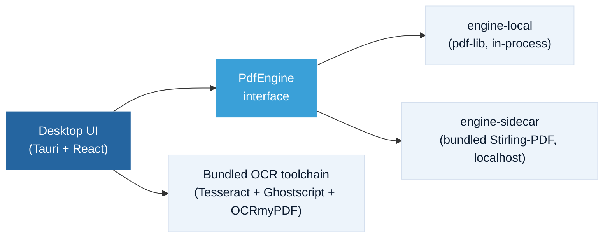

  

<h1 align="center">RaioPDF</h1>

<strong>A free, fully-local desktop PDF suite for law firms.</strong>

  
  
  
  
  

  Everything you use Acrobat for, day to day — free, full-featured, and it never leaves your computer. 
  Plus the legal workflows Acrobat never bothered building.

  <a href="#the-philosophy">Philosophy</a> ·
  <a href="#what-it-does">What it does</a> ·
  <a href="#features">Features</a> ·
  <a href="#what-it-is-not">What it isn't</a> ·
  <a href="#how-its-built">How it's built</a> ·
  <a href="#status">Status</a> ·
  <a href="#license">License</a>

 

> **Pre-alpha — under active development. Nothing to download yet.** "Watch" this repo (top right) to be notified on the first release, or check [raio.macrify.me](https://raio.macrify.me) — the download button there lights up automatically the moment a build exists.

## The philosophy

**A warning shot, not a feature race.** Adobe has spent years pushing Acrobat toward pricier tiers and more features nobody asked for, while locking a fundamentally local task — editing a file that already lives on your machine — behind a mandatory account and a cloud round-trip.

RaioPDF is the opposite bet: **free, full-featured for daily use, entirely on-device, and honest that it collects nothing.**

That's not a claim to beat Acrobat feature-for-feature — it's a different bet on the same job. No cloud, no account, no telemetry, no AI, no data collection. Every operation runs locally, including the ones that normally mean a server round-trip somewhere else: text recognition, redaction, exhibit assembly. Download it, install it, use it. That's the whole deal.

## What it does

Four ways it fits into an actual day at the firm:

| Moment | What happens |
|---|---|
| **Open it and go** | No account screen, no sign-in, no "create a free account to continue." |
| **Drop in a scan, hit "Make Searchable"** | OCR runs entirely offline — no upload, no wait on a server. |
| **One click, "Prepare for Filing"** | Normalizes every page to letter-size portrait and splits an oversized file into properly labeled, sequential, portal-compliant parts. |
| **"Combine with Exhibits"** | Assembles a motion or brief with exhibit files in order, auto-stamped ("Exhibit A" — configurable) and auto-bookmarked. |

## Features

### Core — the day-to-day Acrobat replacement

| Capability | What it means |
|---|---|
| View, search, print | Standard reading and navigation |
| Organize pages | Merge, split, reorder, extract, insert, rotate, crop |
| **Make Searchable** | Fully offline OCR for scanned documents |
| Annotate | Highlight, comment, draw, stamp |
| Fill & sign | Add text and images, fill forms, signature stamp + flatten |
| Compress & protect | File compression, passwords, permissions |
| No catches | No watermarks, no nag screens, ever |

### Legal — the workflows Acrobat doesn't ship

| Workflow | What it means |
|---|---|
| **Prepare for Filing** | One click: normalizes every page to letter-size portrait; if the file exceeds the e-portal size limit, splits it into properly labeled sequential parts exported as PDF/A |
| **Combine with Exhibits** | Assembles a motion or brief with exhibit files in order, auto-stamped and auto-bookmarked |
| **True redaction** | Content is actually removed and verified by re-extraction — not a black box drawn over text that's still underneath |
| **Bates numbering** | Across an entire document set, in one pass |
| **Sensitive-info scanner** | Assistive detection of SSNs and account numbers, per Fla. R. Jud. Admin. 2.425 |
| **Metadata scrubbing** | Before production or filing |
| **e-filing preflight report** | Rule citations attached (Fla. R. Jud. Admin. 2.520 / 2.525) |

All of the above are planned/in-progress for the first release — see [Status](#status).

## What it is not

- **Not "AI-powered."** No AI runs anywhere in RaioPDF — that's a selling point, not a gap.
- **Not released yet.** Pre-alpha, no promised date.
- **Not cross-platform yet.** Windows first. macOS later — no date promised.
- **Not a feature-by-feature Acrobat killer.** A different bet on the same job.

## How it's built

A [Tauri](https://tauri.app) desktop shell with a custom, Acrobat-familiar UI, running the MIT-licensed [Stirling-PDF](https://github.com/Stirling-Tools/Stirling-PDF) backend engine as a bundled localhost sidecar — no Docker, no Java setup, it's all inside the installer — plus a bundled Tesseract/Ghostscript/OCRmyPDF toolchain for fully offline OCR.

Everything in that diagram runs on your machine. Nothing in it talks to the internet. See [`docs/ARCHITECTURE.md`](docs/ARCHITECTURE.md) for the full breakdown, including how the Stirling-PDF engine is vendored and scrubbed to its MIT-licensed core only ([`docs/ENGINE-VENDORING.md`](docs/ENGINE-VENDORING.md)).

## Status

**Pre-alpha.** Built in the open — every feature above is being implemented against the architecture in [`docs/`](docs/). Windows ships first; macOS is planned with no committed date.

The landing page at [raio.macrify.me](https://raio.macrify.me) tracks the live GitHub release automatically — there's no download link to click until a real build exists behind it.

## License

RaioPDF is licensed under [GPL-3.0](LICENSE). It bundles third-party components under their own licenses (MIT Stirling-PDF engine, Apache-2.0 Tesseract and PDF.js, AGPL Ghostscript, and others) — see [`licenses/THIRD-PARTY.md`](licenses/THIRD-PARTY.md) for full third-party notices.

## Support

- Bugs and feature requests: [GitHub Issues](https://github.com/Macrify-LLC/raiopdf/issues)
- Email: support@macrify.me *(best effort — this is free, community-supported software)*

---

  Published as a public service to the legal community by  
  <picture>
    <source media="(prefers-color-scheme: dark)" srcset="site/assets/macrify-wordmark-light.png">
    
  </picture>

