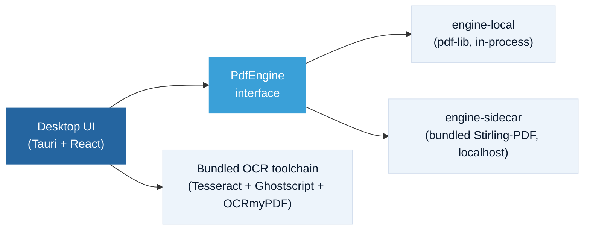
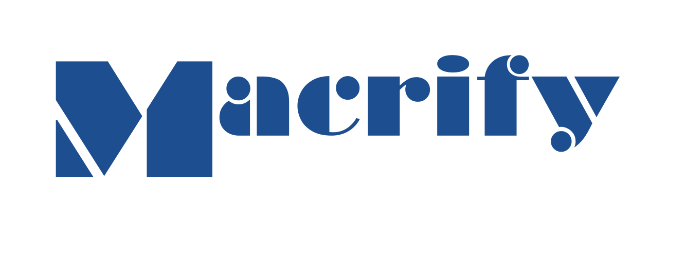

  

<h1 align="center">RaioPDF</h1>

<strong>A free, fully-local desktop PDF suite for law firms.</strong>

  
  
  
  
  

  Everything you use Acrobat for, day to day — free, full-featured, and it never leaves your computer. 
  Plus the legal workflows Adobe never bothered building.

  <a href="#the-philosophy">Philosophy</a> ·
  <a href="#what-it-does">What it does</a> ·
  <a href="#features">Features</a> ·
  <a href="#what-it-is-not">What it isn't</a> ·
  <a href="#how-its-built">How it's built</a> ·
  <a href="#status">Status</a> ·
  <a href="#license">License</a>

 

> **Pre-alpha — under active development. Nothing to download yet.** "Watch" this repo (top right) to be notified on the first release, or check [raio.macrify.me](https://raio.macrify.me) — the download button there lights up automatically the moment a build exists.

## The philosophy

Nothing makes me feel more like a crotchety old man than how software works today. I remember when you got software by someone handing you a floppy disk and that was that. But at some point, software companies realized that they could make unlimited money by renting the software out to users rather than selling it, and that became the only way productivity software was sold. And because software was so technically complicated and expensive to make, customers didn't have much of a choice in the matter.

Nobody at my firm likes dealing with Acrobat. Its bloat stresses computers, its licensing quirks can bring work to a standstill, it constantly pushes features nobody wants to use, and we're paying thousands for the privilege. Editing a file that's already sitting on your own computer shouldn't require an account, a cloud upload, and a cavalcade of minor annoyances. So in this age of agentic coding, I asked how hard it would be to build a fully featured PDF program the old fashioned way. Turns out it's not that hard.

RaioPDF is the other way of doing it: **a full, genuinely useful PDF suite — including the less-glamorous legal stuff like true redaction and Bates numbering — given away for free, running entirely on your own machine, permanently.**

Turns out you don't need a subscription and a login screen to make solid software — you just have to build it. And once someone proves that, "this is just how PDF software works now" stops being true. That's really the point: not to out-feature any particular vendor, but to show a firm doesn't have to just accept whatever terms it's handed for a task this basic.

And because you can just build it yourself, you can add in the functionality you've always wanted and leave out the stuff you don't. Regulating PDFs for e-filing has always been a major annoyance of mine. Some features, like exporting a PDF into size-limited chunks, just don't seem to exist in Acrobat (or I can't find them). Some are buried under a hundred configurations I don't want or understand.

I believe that using Raio is a genuinely **better experience** than using Acrobat. Without the bloat, it's snappier. Without all of the features I've never used, it's less confusing and clunky to operate. And with the additional law practice-specific improvements, a lot of pain points of practice are smoothed out.

This went from an idea to a working prototype in about twelve hours. Not because I'm an engineering prodigy — I'm a lawyer — but because the tools for building solid, deterministic software have gotten game-changingly powerful. If one attorney with a laptop can put a real dent in "free local PDF suite" over the course of an evening, the assumption that you need a giant company and a subscription to get decent software was already on its way out.

The spirit airlines of software is arriving, and even if you don't like it, the Adobes, Microsofts, and others in the world are going to have to start competing with software that is **free, convenient, reliable, and easy to use**.

## What it does

Four ways it fits into an actual day at the firm:

| Moment | What happens |
|---|---|
| **Open it and go** | No account screen, no sign-in, no "create a free account to continue." |
| **Drop in a scan, hit "Make Searchable"** | OCR runs entirely offline — no upload, no wait on a server. |
| **One click, "Prepare for Filing"** | Normalizes every page to letter-size portrait and splits an oversized file into properly labeled, sequential, portal-compliant parts. |
| **"Combine with Exhibits"** | Assembles a motion or brief with exhibit files in order, auto-stamped ("Exhibit A" — configurable) and auto-bookmarked. |

## Features

### Core — the everyday stuff

| Capability | What it means |
|---|---|
| View, search, print | Standard reading and navigation |
| Organize pages | Merge, split, reorder, extract, insert, rotate, crop |
| **Make Searchable** | Fully offline OCR for scanned documents |
| Annotate | Highlight, comment, draw, stamp |
| Fill & sign | Add text and images, fill forms, signature stamp + flatten |
| Compress & protect | File compression, passwords, permissions |
| Native MCP Integration | No AI features (intentional), but speaks natively to your AI agents |
| No catches | No watermarks, no nag screens, ever |

### Legal — the stuff nobody bothered building for lawyers

| Workflow | What it means |
|---|---|
| **Prepare for Filing** | One click: normalizes every page to letter-size portrait; if the file exceeds the e-portal size limit, splits it into properly labeled sequential parts exported as PDF/A |
| **Combine with Exhibits** | Assembles a motion or brief with exhibit files in order, auto-stamped and auto-bookmarked |
| **True redaction** | Content is actually removed and verified by re-extraction — not a black box drawn over text that's still underneath |
| **Bates numbering** | Across an entire document set, in one pass |
| **Sensitive-info scanner** | Assistive detection of SSNs and account numbers, per Fla. R. Jud. Admin. 2.425. Just a flag — this is vibe coded and you should never trust AI with legal reasoning. |
| **Metadata scrubbing** | Before production or filing |
| **e-filing preflight report** | Rule citations attached (Fla. R. Jud. Admin. 2.520 / 2.525) |

All of the above are planned/in-progress for the first release — see [Status](#status).

## What it is not

- **Not "AI-powered."** No AI features built into RaioPDF — if I wanted an AI summary I could go to a million other more useful places first.
- **Not released yet.** Pre-alpha, no promised date. But if you want it I'll give it to you.
- **Not cross-platform yet.** Windows first. macOS later — no date promised.
- **Not trying to win a features arms race.** This isn't about beating anyone spec-for-spec — it's about proving the free, local, and genuinely **competitive** alternative can exist at all.
- **Not phoning home.** No telemetry, no background analytics — RaioPDF makes no network requests of its own, and the content-security policy only lets it reach its own bundled engine. If it ever crashes, it can offer to open a pre-filled GitHub issue in your browser for you to review and submit yourself — that's opt-in, off by default, and the only thing that ever leaves your machine, only if you choose it.

## How it's built

A [Tauri](https://tauri.app) desktop shell with a custom UI built to feel familiar from the first click, running the MIT-licensed [Stirling-PDF](https://github.com/Stirling-Tools/Stirling-PDF) backend engine as a bundled localhost sidecar — no Docker, no Java setup, it's all inside the installer — plus a bundled Tesseract/Ghostscript/OCRmyPDF toolchain for fully offline OCR.

Everything in that diagram runs on your machine. Nothing in it talks to the internet. See [`docs/ARCHITECTURE.md`](docs/ARCHITECTURE.md) for the full breakdown, including how the Stirling-PDF engine is vendored and scrubbed to its MIT-licensed core only ([`docs/ENGINE-VENDORING.md`](docs/ENGINE-VENDORING.md)).

Optionally, an off-by-default "bring your own AI" connector lets your own AI assistant (Claude Desktop / Claude Code) operate RaioPDF's local tools over [MCP](https://modelcontextprotocol.io) — still entirely on-device, no AI inside RaioPDF itself. See [`docs/MCP.md`](docs/MCP.md).

## Status

**Pre-alpha.** Built in the open — every feature above is being implemented against the architecture in [`docs/`](docs/). Windows ships first; macOS is planned with no committed date.

The landing page at [raio.macrify.me](https://raio.macrify.me) tracks the live GitHub release automatically — there's no download link to click until a real build exists behind it.

## License

RaioPDF is licensed under [GPL-3.0](LICENSE). It bundles third-party components under their own licenses (MIT Stirling-PDF engine, Apache-2.0 Tesseract and PDF.js, AGPL Ghostscript, and others) — see [`licenses/THIRD-PARTY.md`](licenses/THIRD-PARTY.md) for full third-party notices.

## Support

- Bugs and feature requests: [GitHub Issues](https://github.com/Macrify-LLC/raiopdf/issues)
- Email: support@macrify.me *(best effort — this is free, community-supported software)*

---

  Published as a public good and also to swag on em by  
  <picture>
    <source media="(prefers-color-scheme: dark)" srcset="site/assets/macrify-wordmark-light.png">
    
  </picture>

